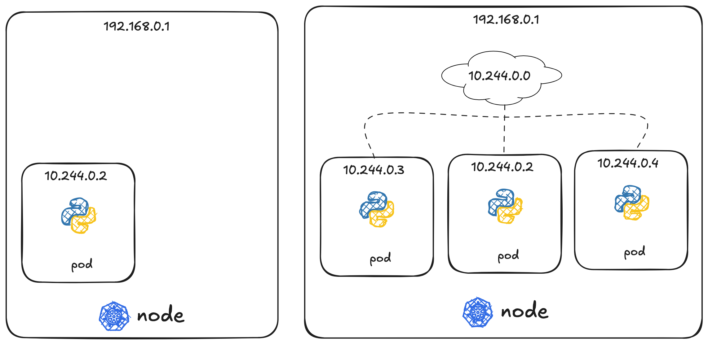
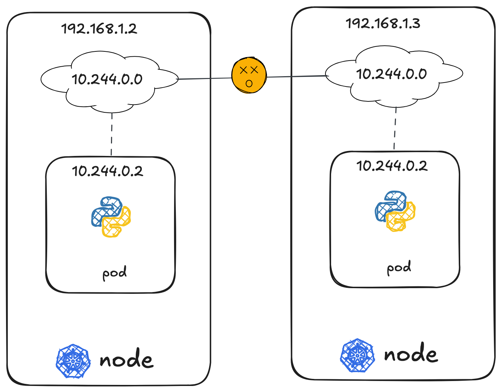
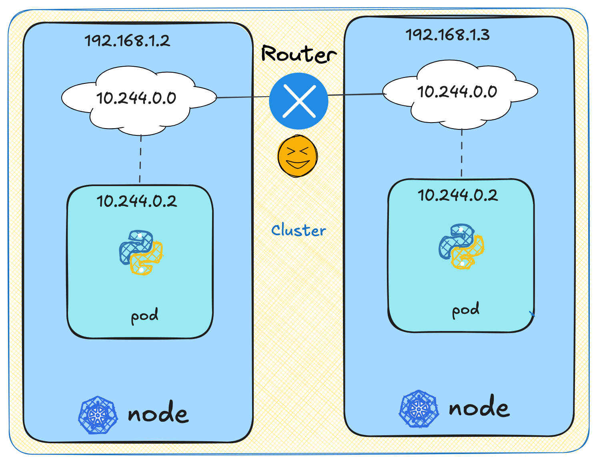

# Networking in K8s

- The node has an IP address. Say it is one 192.168.1.2
- On the single node kubernetes cluster, we have created a single pod
- a pod host a container but unlike in the Docker world where an IP address always assigned to a docker container.
- In the k8s world, the IP address is assigned to a pod.
- In this case, it's in the range ten point to 44 series and the IP assigned to the pod is 10.244.0.2.

- So how is it getting this IP address?
- When kubernetes is initially configured?
- We create an internal private network with the address `10.244.0.0` and all the ports are attached to it
- When you deploy multiple ports, they all get a separate IP assigned from this network. 

## Multiple Nodes

How does it work when you have multiple nodes in your cluster?

- In this case you have two nodes running kubernetes and they have IP addresses `192.168.1.2` and  `192.168.1.3` assigned to them
- they are not part of the cluster yet
- Each of them has a single pod deployed as disscussed in the previous slide
- These pods are attached to an internal network and they have their own IP addresses assigned.
- However, if you look at the internal network addresses, you can see that they are the same.
    - The two networks have an address `10.244.0.0` and the paths deployed have the same address.
- This is not going to work well
- Because when the nodes are part of the same cluster, the pods have the same IP addresses assigned to them, and
- that will lead to IP conflicts in the network

- When k8s cluster is setup, Kubernetes does not automatically set up any kind of networking to handle these issues.
- As a matter of fact, Kubernetes expects us to set up networking to meet certain fundamental requirements.
- Some of these are that all the containers or pods in a Kubernetes cluster must be able to communicate with one another without having to configure Nat.
- All nodes must be able to communicate with containers and all containers must be able to communicate with the nodes in the cluster.
- Kubernetes expects us to set up a networking solution that meets these criteria.
- Fortunately, we don't have to set it up all on our own as there are multiple pre-built solutions available.
- Some of them are the Cisco ACI networks psyllium, big cloud, fabric, flannel, VMware and Zest and Calico, depending on the platform you're deploying your Kubernetes cluster on.
