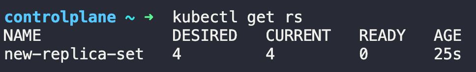

# Questions
1. how many pods are exist on the system?
2. how many Replicaset are exist on the system?
3. How about now? How many ReplicaSets do you see?
4. How many PODs are DESIRED in the `new-replica-set`?
5. What is the image used to create the pods in the `new-replica-set`?
6. How many PODs are READY in the `new-replica-set`?
7. Why do you think the PODs are not ready?
8. Delete any one of the 4 PODs.
9. How many PODs exist now?
10. Why are there still 4 PODs, even after you deleted one?
11. Create a replicaset using this replicaset-definition.yaml file, but here is an issue with the file, so try to fix it.
    ````yml
    apiVersion: v1
    kind: ReplicaSet
    metadata:
        name: replicaset-1
    spec:
    replicas: 2
    selector:
        matchLabels:
        tier: frontend
    template:
        metadata:
            labels:
                tier: frontend
        spec:
            containers:
              - name: nginx
                image: nginx
    ````
12. Scale the ReplicaSet to 5 PODs.


# Answer
1. run `kubectl get pods`
2. run `kubectl get replicaset` or `kubectl get rs` -> 0
3. run `kubectl get replicaset` or `kubectl get rs` -> 1
    
4. -> 4
5. run `kubectl describe rs new-replica-set` -> busybox777
6. -> 0
7. -> the image is not available
8. run `kubectl delete pod new-replica-set-xmttr`
9. run `kubectl get pods` -> 4
10. replicaset ensure that the specified number of pods are running at all times even if it's just one or hundred.
11. run `kubectl explain replicaset`
12. Use `kubectl scale` command or edit the replicaset using `kubectl edit replicaset`.


